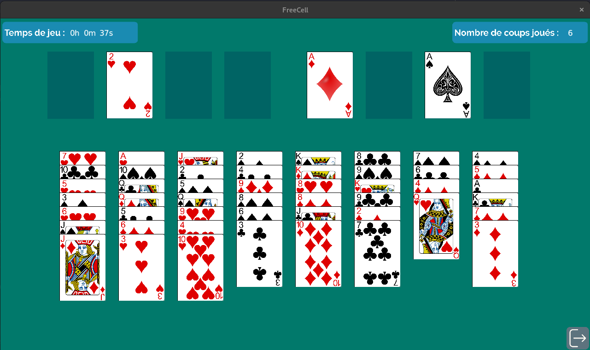
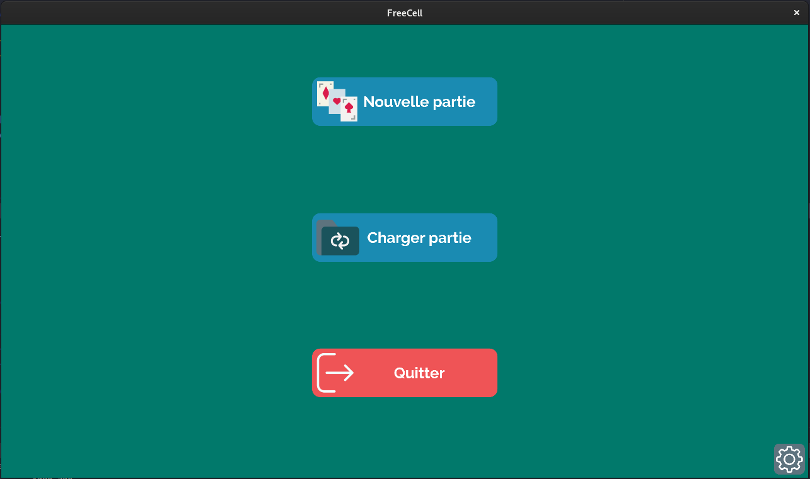

# Freecell 
Jeu Freecell réalisé dans le cadre d'un mini-projet.

Librairies utilisées : 
- https://github.com/dtschump/CImg
- https://github.com/nothings/stb

Réalisé par Kamil CAGLAR (kamil.caglar@telecom-st-etienne.fr) & Jean-Baptiste JACQUET (jean-baptiste.jacquet@telecom-st-etienne.fr)
